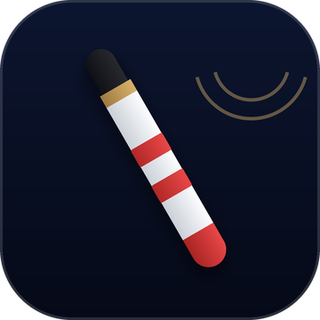
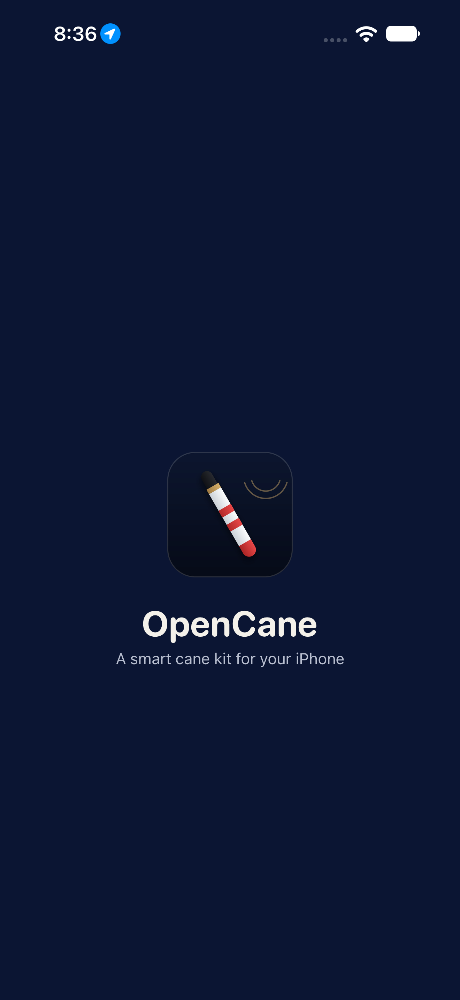
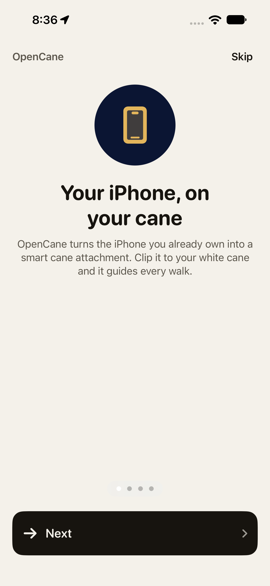
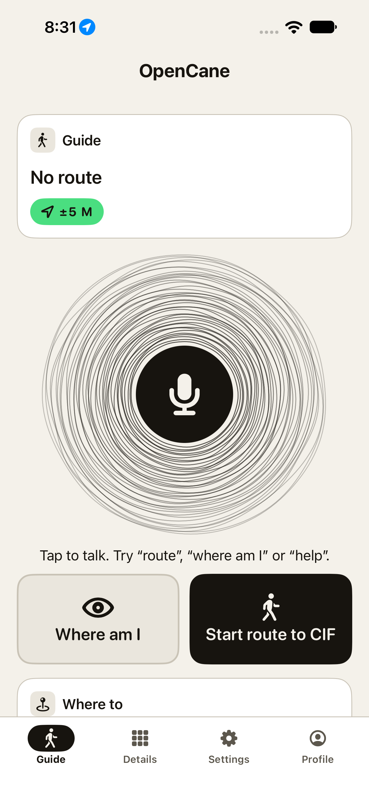
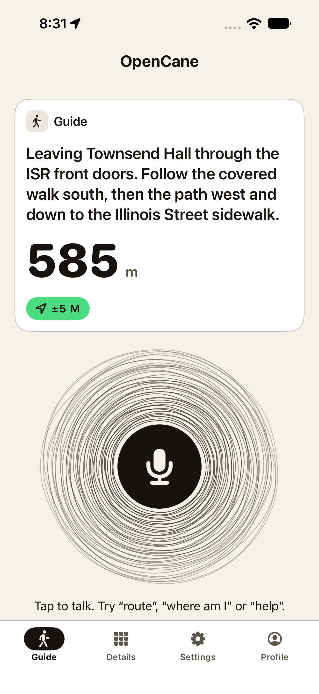
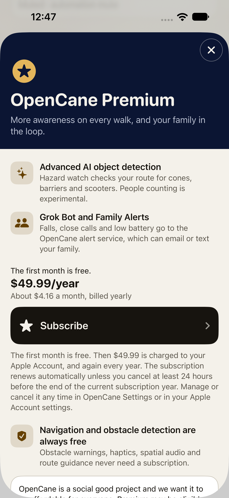
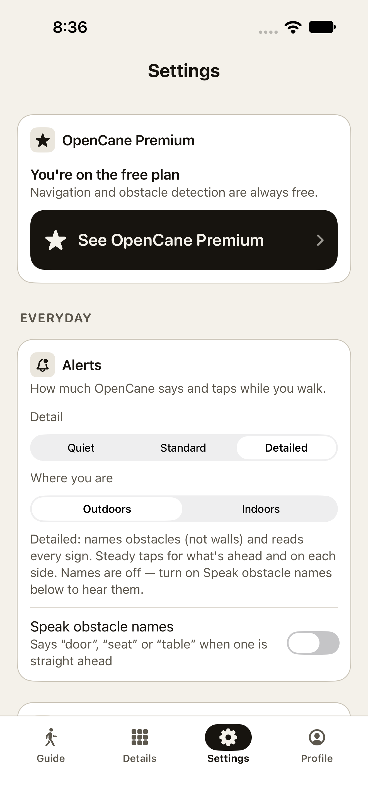

<p align="center">
  
</p>

<h1 align="center">OpenCane</h1>

<p align="center"><b>A smart-cane kit that clips an iPhone onto the white cane you already own.</b><br>
LiDAR warnings at waist and head height, haptics through the cane, spatial-audio guidance.<br>
Free where it matters for safety. Open source (MIT).</p>

---

## What OpenCane does

A white cane finds what is on the ground. It misses what is at waist and head height: a low
branch, a truck mirror, a sign bolted at face level. OpenCane clamps an iPhone Pro to the cane and
makes the phone the only computer in the kit:

- **Obstacle detection.** The LiDAR scanner watches the path at waist and head height. The Taptic
  Engine shakes the cane, and "Head height." is spoken before you reach an overhang.
- **Guidance.** GPS and a waypoint engine guide the walk. AirPods Pro play a spatial beacon from the
  direction to walk, and the Apple Watch taps turns and crossings onto the wrist.
- **Hands-free.** Siri, the Action button and "Talk to OpenCane" cover every control, and
  "Where am I" describes the scene, on the phone when there is no network.
- **Hardware you can print.** The mount is 3D-printed ([`hardware/`](hardware/)); nothing needs to
  be bought beyond the phone.

### Free, and OpenCane Premium

| Always free | OpenCane Premium, $49.99/year |
|---|---|
| LiDAR obstacle detection, head-height warnings, drop-off / sign / siren warnings | **Advanced AI object detection**: Hazard watch (cones, barriers, scooters on your route) and people counting |
| Haptics through the cane, spatial audio, speech | **Grok Bot and Family Alerts**: your family hears about a fall, a close call or a low battery |
| Turn-by-turn walking navigation, Apple Watch cues, "Where am I", emergency calling | |

The paywall **never appears during a walk**. Subscriptions run on [RevenueCat](https://www.revenuecat.com).
OpenCane is a social good project, and Premium may be eligible for reimbursement through
insurance, an HSA/FSA or a vision rehabilitation program.

## Screenshots

<p>
  
  
  
  
  
  
</p>

The 1024 App Store icon is [`docs/images/opencane-icon-1024.png`](docs/images/opencane-icon-1024.png).

## Hardware

| Part | Role |
|---|---|
| iPhone with LiDAR (a Pro model; built on an iPhone 17 Pro Max, iOS 27) | The only computer. LiDAR depth, Core Haptics through the cane, GPS + compass, camera |
| Non-metal cane shaft (the prototype uses a 27.65 mm broom handle) | The cane |
| Printed phone mount | Clamps the phone to the shaft: the screwless mount in [`hardware/mount_screwless/`](hardware/mount_screwless/) (print runbook: [`hardware/3d_print_files/README.md`](hardware/3d_print_files/README.md)) |
| AirPods Pro *(optional)* | Spatial-audio beacon, speech, head direction |
| Apple Watch *(optional)* | Wrist taps for turns, crossings and arrival; Repeat / Next / Describe / Recenter |
| Power bank *(recommended)* | ARKit + LiDAR run about 3–4 h on the phone battery |
| Mac with Xcode 27 | Builds and installs. Nothing talks to it at runtime. |

An iPhone without LiDAR installs and guides, and says that obstacle warnings need LiDAR.

## Build and run from a fresh clone

You need a Mac with **Xcode 27** (with the watchOS platform) and **XcodeGen** (`brew install xcodegen`).

```sh
git clone https://github.com/TCYTseven/OpenCane.git
cd OpenCane/ios
make gen        # generates CaneKit.xcodeproj and creates the git-ignored Secrets.plist from the template
make test       # the CaneKitLogic unit tests (no simulator needed)
make sim        # simulator build; the first build downloads the RevenueCat package
open CaneKit.xcodeproj   # then Run the CaneKit scheme on a simulator or your iPhone
```

**Keys** go in `ios/CaneKit/Resources/Secrets.plist`, which is git-ignored and bundled into the app,
so add them before you build. Every key is optional. Without any key the app still runs: the iPhone
voice speaks, "Where am I" answers on the phone, and with no RevenueCat key every feature is
unlocked and Settings says so.

| Key | For |
|---|---|
| `REVENUECAT_API_KEY` | OpenCane Premium. The **public** Apple API key from RevenueCat → Project → API keys (`appl_…`). Never a secret key. |
| `ELEVENLABS_API_KEY` | The natural voice |
| `CUSTOM_*`, `ANTHROPIC_API_KEY`, `GEMINI_API_KEY`, `OPENAI_API_KEY` | The cloud model for "Where am I" and Hazard watch (on-device otherwise) |
| `OPENCANE_GROKBOT_WEBHOOK_URL` / `_KEY` | Family alerts through the Grok Bot routine |

The full list is in [`ios/README.md` §4](ios/README.md#4-secrets-and-permissions).

**On your iPhone:** turn on Developer Mode and pick your team in Xcode (CaneKit target → Signing &
Capabilities), then Run. Or from the command line, put `TEAM` and `DEVICE` in `ios/local.mk` and run
`make run`. [`ios/README.md` §3](ios/README.md#3-build-install-launch) walks through it, and
[`docs/devices_setup.md`](docs/devices_setup.md) covers the AirPods, the watch and an untethered walk.

## Test the paywall

**Fastest: RevenueCat Test Store (simulator or phone, no App Store Connect, no Apple account).**
Put a RevenueCat Test Store key (`test_…`, RevenueCat → Project → API keys) in `Secrets.plist` as
`REVENUECAT_API_KEY`, set up the product, entitlement and offering as in step 1 below under the
project's Test Store app, then from `ios/` run `make uitest-store SIM="<simulator name>"`. It buys
Premium end to end: Details → Hazard watch → paywall ("The first month is free. $49.99/year") →
Subscribe → RevenueCat's "Test valid purchase" → Hazard watch on → Settings "OpenCane Premium is
on". Screenshots land in `ios/build/store-shots`. Or Run from Xcode and tap through it by hand.
The Test Store runs subscription periods fast, so the trial converts in minutes. That is
RevenueCat's test clock, not a bug.

**Judges:** every new install gets the one-month free trial on the annual product. A judge can
also be given Premium: Settings → OpenCane Premium → **Copy support ID**, send it to the team, and
the team pastes it into RevenueCat → Customers → Entitlements → **Grant** `premium`.

A Test Store key only runs the store in a **Debug** build (Xcode Run, the simulator). purchases-ios
stops a Release build that has one ("Wrong API Key", then a crash), so OpenCane skips the store in
that case: a TestFlight build made with a Test Store key opens with every feature unlocked. Use an
App Store key (`appl_…`) for a TestFlight build that should sell Premium.

**Or locally through StoreKit.** Purchases can be tested without App Store Connect, through the StoreKit configuration file
[`ios/StoreKit/OpenCane.storekit`](ios/StoreKit/OpenCane.storekit). It defines one annual
auto-renewing subscription, `opencane_premium_annual`, at $49.99, with a one-month free
introductory offer, and the CaneKit scheme's Run action already selects it.

1. **In RevenueCat:**
   - create a project with an iOS app for the bundle id `com.aritro.canekit`;
   - add the product `opencane_premium_annual`;
   - attach it to an entitlement named `premium`;
   - put it as the Annual package of an offering named `default`, and make that offering current.
2. **In Xcode**, open `ios/StoreKit/OpenCane.storekit`, choose Editor → Save Public Certificate,
   and upload the certificate to the RevenueCat app's settings. That lets RevenueCat validate
   local StoreKit purchases.
3. Put the RevenueCat public API key in `Secrets.plist` as `REVENUECAT_API_KEY`, then build and
   Run from Xcode.
4. Open **Details → Hazard watch** (or Settings → OpenCane Premium → See OpenCane Premium) and
   tap **Subscribe**. The StoreKit test sheet appears. After the purchase the paywall closes and
   the feature is on.
5. To buy again, open Xcode → Debug → StoreKit → Manage Transactions and delete the transaction.
   Refunds, expiry and renewals can be simulated there too.

Settings → OpenCane Premium shows the subscription status, **Restore Purchases** and **Manage
Subscription**. For UI tests without a store, launch with `CANEKIT_PREMIUM=free` or
`CANEKIT_PREMIUM=premium`.

## Tech stack

- **Swift 6** with strict concurrency (main-actor by default), **SwiftUI**, iOS 26 deployment
  target, **XcodeGen** project ([`ios/project.yml`](ios/project.yml)).
- **Apple frameworks:** ARKit + LiDAR scene depth and mesh classification, Core Haptics,
  AVAudioEngine spatial audio (HRTF), AVSpeechSynthesizer, Speech, SoundAnalysis (sirens and horns), Vision, Foundation Models
  (on-device "Where am I"), CoreLocation + MapKit walking directions, WatchConnectivity,
  ActivityKit (Live Activity and Dynamic Island), App Intents (Siri and the Action button),
  HealthKit, StoreKit.
- **RevenueCat** `purchases-ios` for OpenCane Premium: the only third-party package, isolated in
  one file ([`EntitlementManager.swift`](ios/CaneKit/Store/EntitlementManager.swift)).
- **CaneKitLogic**, a pure-Swift package with every rule that has a number in it (lane math, cue
  timing, geofences, the Premium gate) and its Swift Testing suite (975 tests on the last local run; recount with `grep -rhoE '^\s*@Test' ios/Logic/Tests | wc -l`) that also runs on Linux.
- Optional services: ElevenLabs (voice), an OpenAI-compatible, Anthropic, Gemini or OpenAI vision
  model, a Grok Bot routine for family alerts, and Supabase for an opt-in cloud mirror.

## Team

Built at 54FoundersHack in Champaign-Urbana and polished for the RevenueCat Shipaton.
**Aritro**, **Aarav**, **Tejas** (software / iOS app); **Sagar**, **Tommy** (hardware, 3D printing, CAD).

The team is at the University of Illinois Urbana-Champaign and is working with the university
and the [Landuyt Center for Entrepreneurship](https://landuyt.illinois.edu/).

Inside the repo the code is still called **CaneKit**: the Xcode project, targets, the `CaneKitLogic`
module, the `ios/CaneKit/…` paths and the bundle id `com.aritro.canekit`. Only what a person sees
or hears says OpenCane. [`AGENTS.md`](AGENTS.md) → "The name split" explains why.

If you are about to change code, read [Contributing](#contributing) before you edit.

## Recognition

- **First place overall** at 54FoundersHack, 1st of 250.
- **Third place** on the SpaceX track at the same hackathon. SpaceXAI ambassadors are working with the team.
- The launch posts passed **100,000 impressions** on LinkedIn. **More than 100 schools** across the country have written in.
- Funding is in place to keep building.

## Contributing

Read [`AGENTS.md`](AGENTS.md) before the first edit. It wins when documents disagree. The shipped
code wins when a document disagrees with the code: fix the document in the same change.

1. Find the file in [`docs/CODE_REFERENCE.md`](docs/CODE_REFERENCE.md). The data-flow diagram is at the top of that file.
2. A rule with a number in it goes in `ios/Logic` (`CaneKitLogic`) with a Swift Testing test. From `ios/`, `make test` must pass on its own exit code. Never judge it through `| tail`.
3. OpenCane Premium is the one third-party dependency (RevenueCat `purchases-ios`). The gate is [`Premium.swift`](ios/Logic/Sources/CaneKitLogic/Premium.swift), the store client is [`EntitlementManager.swift`](ios/CaneKit/Store/EntitlementManager.swift), the screen is [`PaywallView.swift`](ios/CaneKit/UI/PaywallView.swift), and the walk lock is [`AppModel+Premium.swift`](ios/CaneKit/App/AppModel+Premium.swift). The paywall does not open during a walk. The local product is [`OpenCane.storekit`](ios/StoreKit/OpenCane.storekit): `opencane_premium_annual`, $49.99/year, one month free.
4. Spoken and visible strings say OpenCane. Types, paths, the module and the bundle id stay CaneKit.
5. These paths were removed on purpose. Do not recreate them: `docs/todo.md`, `docs/TEAM_BRIEF.md`, `docs/TEAM_HANDOFF.md`, `docs/ideas.md`, `docs/superpowers/`. The step log is `git log`. [`CHANGELOG.md`](CHANGELOG.md) stays the short submission note.


## Repo map

| Path | What |
|---|---|
| [`AGENTS.md`](AGENTS.md) | **Read before editing.** Hard rules, "How we engineer", commands, and the deliberate behaviours that look like bugs. |
| [`docs/README.md`](docs/README.md) | Index of every doc with when to read it, plus a "Where do I find…" table |
| [`docs/CODE_REFERENCE.md`](docs/CODE_REFERENCE.md) | Map of every file, type and function, with the data-flow diagram |
| [`CHANGELOG.md`](CHANGELOG.md) | Where this submission stands. The step-by-step build log is in git history. |
| [`ios/`](ios/) | The app (code name CaneKit, display name OpenCane): `CaneKit/` iPhone app, `CaneKitWatch/`, `CaneKitWidget/` Live Activity, `Shared/`, `Logic/` SwiftPM package (`CaneKitLogic`, every numeric decision + its unit tests), `CaneKitUITests/`, `project.yml` (XcodeGen), `Makefile`, `scripts/` (test, e2e, cue audit, probes). See [`ios/README.md`](ios/README.md). |
| [`docs/`](docs/) | Design system, hands-free guide, device setup, route evidence, testing plans |
| [`hardware/`](hardware/) | Physical kit: `mount_screwless/` (the live mount, OpenSCAD source), `3d_print_files/` (print runbook; G-code/STLs generated locally), `mount/` (screwed draft + tilt model), `cane_tip/` (printed rolling ball tip) |
| [`scripts/`](scripts/) | Windows mount toolchain (PowerShell + Node): render STLs, slice G-code, verify the screwless mount |
| `firmware/`, `cad/`, `ios/stretch/` | ESP32 grip firmware and OpenSCAD drafts. Stretch / legacy only. |
| [`graphify-out/`](graphify-out/) | Knowledge graph of the repo (code + docs; the committed report lists 6,511 nodes and 15,384 edges, built from `b0db1ebd`). `GRAPH_REPORT.md` lists the communities, `graph.html` opens in a browser (community view, because the graph is over 5,000 nodes). Query it with `graphify query "<question>"`; refresh with `graphify update .` after code changes. |
| `opencane-hardware-brief.html` | One-page hardware brief for a browser |

## Links

- [`AGENTS.md`](AGENTS.md): rules for anyone editing the repo
- [`ios/README.md`](ios/README.md): build, sign, secrets, testing, gotchas
- [`docs/README.md`](docs/README.md): every doc, and where to find things
- [`docs/devices_setup.md`](docs/devices_setup.md): AirPods + Apple Watch + untethered demo checklist
- [`docs/design.md`](docs/design.md): UI and cue design system
- [`docs/cue_design_v2.md`](docs/cue_design_v2.md): research behind the calmer cue design (Steps 35–45)
- [`docs/handsfree.md`](docs/handsfree.md): every voice command and the Action button, for the walker
- [`docs/stress_test_plan.md`](docs/stress_test_plan.md): device tests, failure injection, go/no-go, demo run sheet
- [`hardware/README.md`](hardware/README.md): the printed phone mount (Sagar, Tommy); print runbook in [`hardware/3d_print_files/README.md`](hardware/3d_print_files/README.md)

## License and privacy

OpenCane is released under the [MIT License](LICENSE). The privacy policy is
[`PRIVACY.md`](PRIVACY.md).
